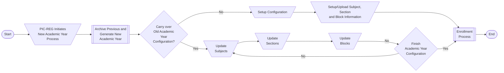
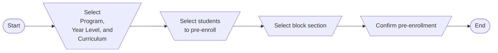
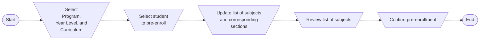

## Workflows

### New Academic Year Setup

1. The registrar or the person-in-charge (PIC-REG) who has the appropriate set of permissions initiates the process of defining a new academic year. The same PIC-REG determines if a blank academic year will be set up or if the setup in the previous academic year will be reused in the upcoming academic year.
    - Academic Year configuration settings of the previous year are archived every new academic year.
2. In both cases, all Academic units that are recognized as owners of the subjects will be notified that a *new academic year* has been initiated and they can start editing their subjects and schedules.
    - Academic units could be departments, institutes, schools or colleges. The main criteria to be considered an academic unit is subject ownership.
    - Subject ownership means that the entity has full control of the subject and can add and delete subjects. Subject owners may also modify the subject contents and properties.
3. The person-in-charge who is assigned by each academic unit (PIC-AU) may then update the configuration by adding new subjects, sections, define new section batches/blocks. Updates made by each academic unit are independent of each other.
    - PIC-AUs may coordinate with each other outside of the system to align their section schedules with each other. PIC-AUs may only edit subjects that are owned by their respective academic units.
4. The registrar is informed when an academic unit completes all of its edits.
5. All academic units should have completed their edits before the enrollment process is triggered by the registrar.
    - The list of students should have also been uploaded before the enrollment process starts

During initial setup, information such as subjects and sections and block sections[1](#blocksections) first need to be defined. For succeeding years, however, the PIC-REG has the option to carry over these settings and do modifications based on current needs such as when new sections need to be opened due to projected demand. 

Because of the relationship between the subject, sections and block sections. It is advised that modifications to the subjects are done first, then the sections, and finally the block sections.

The new academic year setup is used to configure a new academic year and prepares all the necessary information that is needed for the enrollment workflow.

### Enrollment Workflow

Enrollment is the assignment of subjects to students with the goal of determining the final schedule of subjects for each student. The enrollment process has two main phases. The first phase is pre-enrollment where sections are preassigned to each student. Much of the work in the pre-enrollment phase is done by the registrar's office. The process of pre-enrollment of each student depends on whether they are regular or irregular. The second phase of the enrollment is the advising phase. The advising phase provides the possibility for students to request for changes in their schedule. Currently, advising may only be done through the registrar's office. Once the schedule of a student is finalized and the appropriate enrollment fees have been paid, the enrollment process for the student ends.

#### Pre-enrollment

The purpose of pre-enrollment is to lock the subjects and corresponding sections to each student. The pre-enrollment phase assists in building the class schedule and allows modifications to it based on registrar or adviser recommendations. During pre-enrollment phase, a provisional certificate of registration is provided that contains the set schedule of each student and the the total computed fee that needs to be paid before a student can be marked as enrollment.

Pre-enrollment consists of several activities that are done to prior to actual enrollment. User related activites include pre-assignment of subjects and the corresponding sections to students, both regular and irregular.

Pre-enrollment requires the following to be setup first:

- Students
- Curricula
- Programs
- Subjects
- Sections
- Block Sections

##### Regular vs. Irregular

Pre-enrollment consists of several activities are done to prior to actual enrollment. User related activites include pre-assignment of subjects and the corresponding sections to students, both regular and irregular.

Regular students, or those who are on time and have no failing subjects, are usually assigned per block of sections[1](#blocksections). 

Irregular students, who due to various reasons, cannot follow the prescribed curriculum on time cannot be assigned block sections anymore. Due to this, their individual schedules would have to be set manually.

##### Regular Student Subject Assignment

Assigning Sections to Regular Students usually follow the steps outlined below.

1. List **regular** students by selecting program, year level and curriculum and then pressing the `Load students` button.
2. Select **one or more** students to assign a block section to. 
3. The `Pre-enroll students` button will be enabled when at least one student has been selected for pre-enrollment. Click the `Pre-enroll students` button
4. Select the block section to assign students to. The table updates automatically to show the list of subjects that are included in the block section. To confirm the current block section, press `Next`.
5. A `Confirm pre-enrollment` modal will open listing all students who will be assigned sections from the selected block section. Press `Confirm` to continue.
6. A notification modal will confirm success of pre-enrollment task. Press `OK` to continue.
7. The block section pre-enrollment is displayed and the list of students who have not yet been pre-enrolled yet are shown.

##### Irregular Student Subject Assignment

Assigning Sections to Irreglar Students usually follow the steps outlined below.

1. List **irregular** students by selecting program, year level and curriculum and then pressing the `Load students` button.
2. Assigning subjects to an irregular student requires several additional steps:
    1. Select the student to assign sections to. Only one student at a time can be selected because of the student's irregular status. Press the `Next` button to proceed.
    2. Verify the list of subjects and select the sections for each subject. The user has full control over the schedule. Adding and removing subjects are allowed. 
        - Subjects listed are obtained based on the curriculum
        - Subjects that have prerequisites that have not been successfully completed are highlighed to serve as a guide
        - To assist in selecting a section, 
            - The number of units highlight if an underload or overload condition is detected.
            - Schedule conflicts are highighted during the selection of sections. Pre-enrollment cannot be completed when this condition exists.
    3. Review the list of subjects. Only subjects with selected sections are listed here. Once done, click the `Pre-enroll` button.
3. A notification modal will confirm success of pre-enrollment task. Press `Enroll Another` to continue.
4. The user is returned to the original pre-enrollment page to select another student.

#### Advising/Assessment

Student enrollment happens after the pre-enrollment phase.

In the ideal scenario, no problems are encountered and the student accepts the schedule as it is. If there are no changes to the list of pre-enrolled subjects, the student may pay the amount indicated in the provisional COR. Once paid, the students is tagged as enrolled.

The student should go through advising if it is determined that changes are needed in their original schedule. Once they are done with advising, the students may print the final provisional COR and have it assessed prior to payment. Once paid, the student is tagged as enrolled.

Tagging students as enrolled locks all of the subjects as well as fees. Changes after being enrolled would require a Change of Matriculation and is done through a separate process.

#### Enrollment Tagging

Tagging students as enrollment can be done through the enrollment page following the steps outlined below:

1. Select the program and year level of the students who are for enrollment and click the `Load students` button
2. The list of students who are enrolled and are preenrolled are shown. The enrollment status of each student is also shown. Available actions depend on the status of the student.
    - For those who are not yet fully enrolled, tagged as `Pre-enrolled`
        - The temporary certificate of registration can be obtained
        - Subjects and section changes are allowed
        - Can be selected for enrollment
    - For those who are already enrolled, tagged as `Enrolled`
        - The final certificate of registration can be obtained
3. When editing the list of sections and subjects, the following are checked
    -  The number of units highlight if an underload or overload condition is detected.
    - Schedule conflicts are highighted during the selection of sections. Pre-enrollment cannot be 
4. Press the `Enroll` button to tag a selected set of students. 
5. A confirmation box showing the list of students to be enrolled are shown after. Press `Enroll` again to confirm enrollment.
6. A box showing that the enrollment is successful. Press `OK` to close this and return to the list of students for enrollment.

#### Footnotes
<a name="blocksections">1</a>: Block sections are predefined collection of sections.
